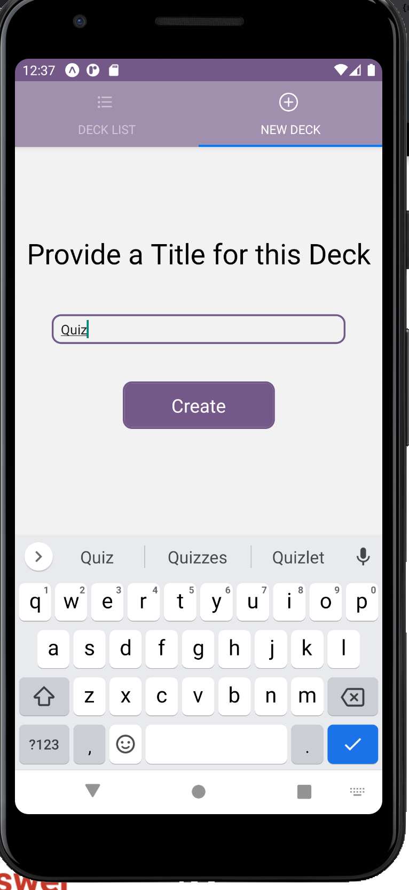
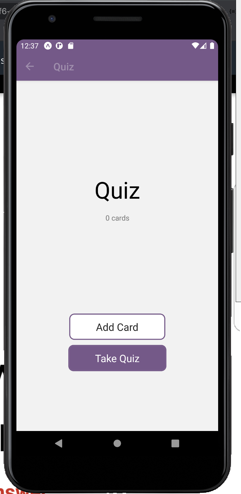
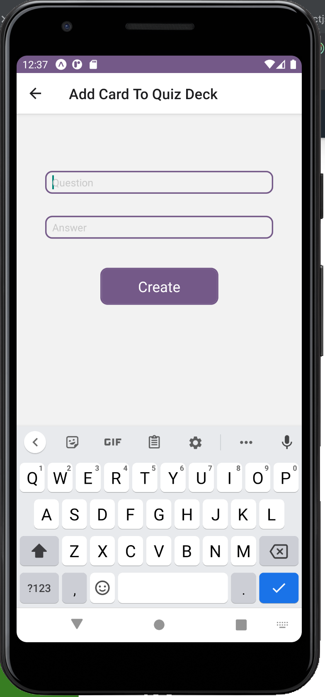
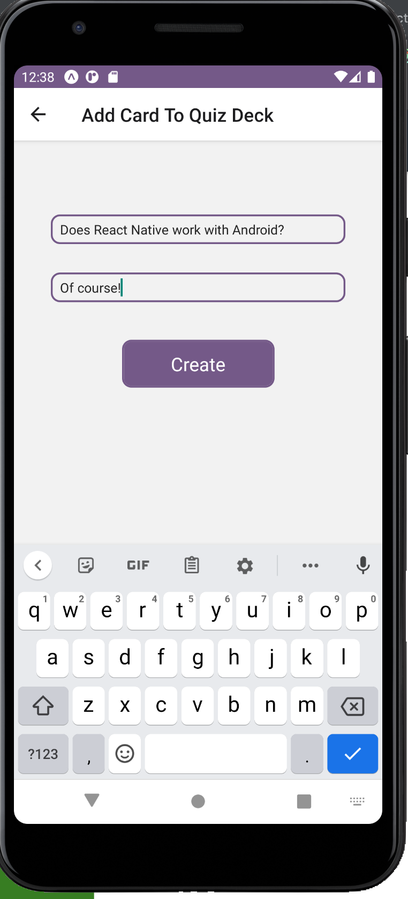
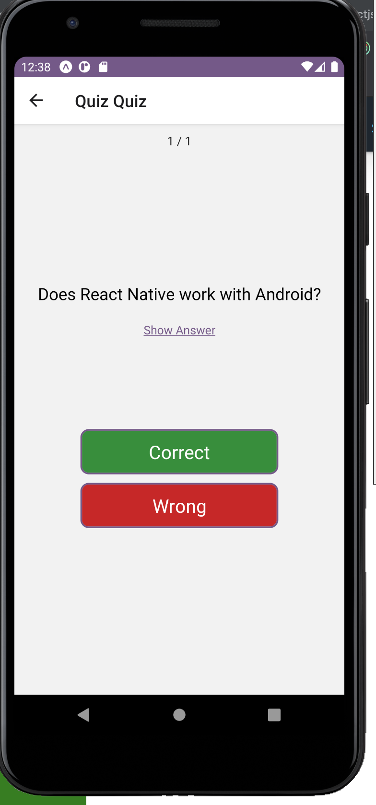
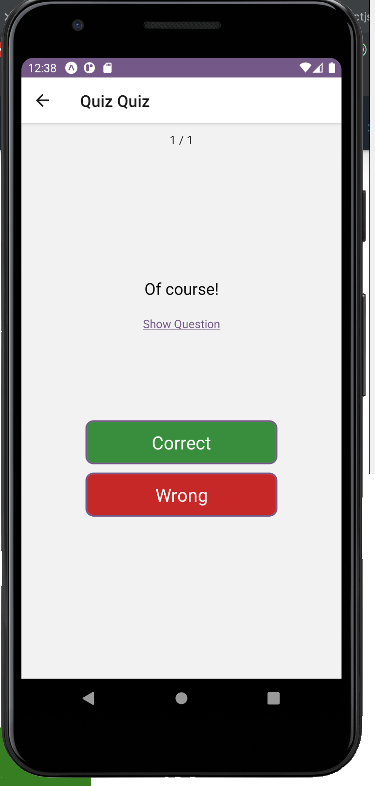
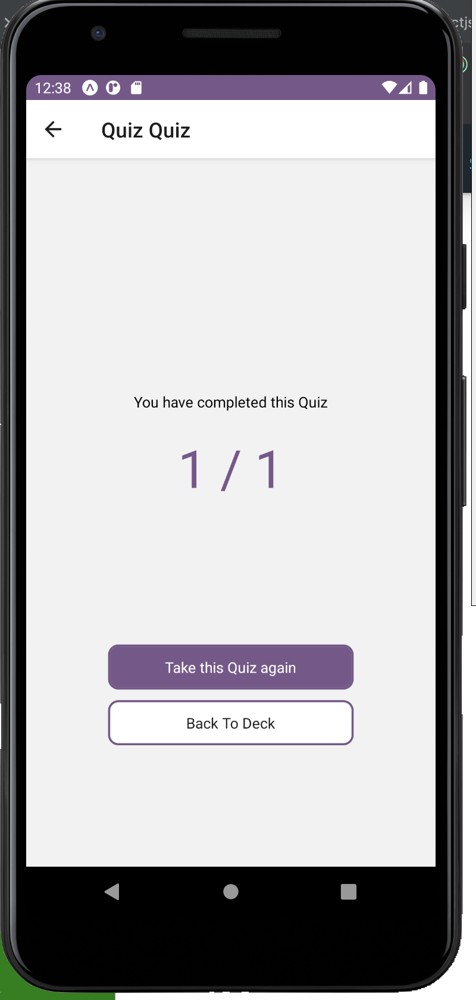
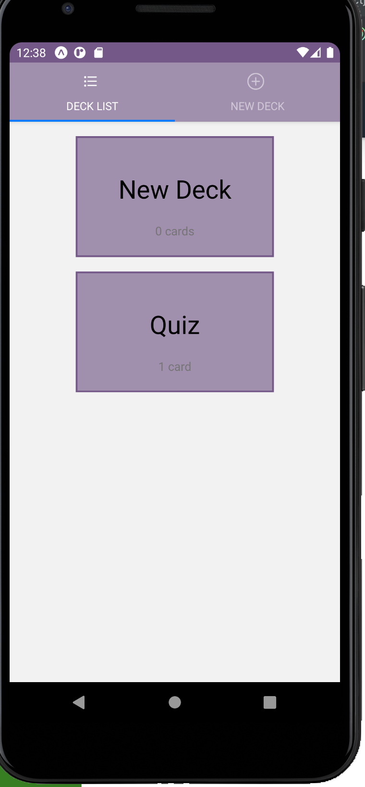

# Mobile Flashcards App

This is Belén Pruvost's assessment project for the React Native module, included in Udacity's React Nanodegree.

It is a mobile application that allows users to study collections of flashcards. The app will allow users to create different categories of flashcards called "decks", add flashcards to those decks, then take quizzes on those decks.a

It was designed for Android and tested on Pixel emulator.

## How to install and run it

- Clone this repo.
- Run `yarn install` in the project directory 
- Run `yarn start`

## Sections

### New Deck
Allows the user to specify the title for a new Deck.

### Deck Overview
Allows the user to have an overview of a given deck, which shows how many cards are included on it.

It also allows the user to add new cards to the deck, or to take the quiz.

### Add Card
For which allows the user to specify a new card for a given deck, by submitting a question and an answer.

### Take Quiz
When the user select the option to take the quiz of a given deck, they will be presented with each card the deck has.

The user can toggle between the question and the answer, and based on that they can select whether they have answered correctly or not.

At the end of the list of cards for a given deck, the user will be presented with their total score.

### Deck List
The user can browse to see the list of all decks that have been defined.

